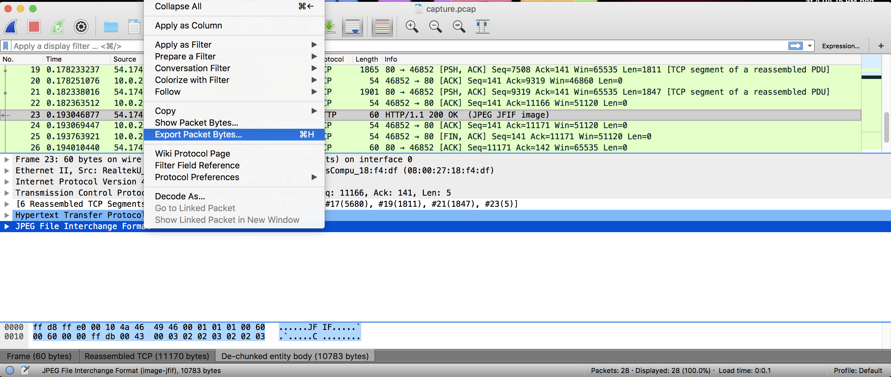

# File Transfer
misc - 40 points

## Challenge 
We noticed someone trying to download a suspicious file on one of our networks. See if you can find out what they were getting from [this](capture.pcap) network capture.

## Hint
Wireshark would be really helpful for this problem!

## Solution
Open in wireshark.

We realise one packet is a JPEG file.

Export it and we find the flag

## Flag

	actf{0ver_th3_w1re}